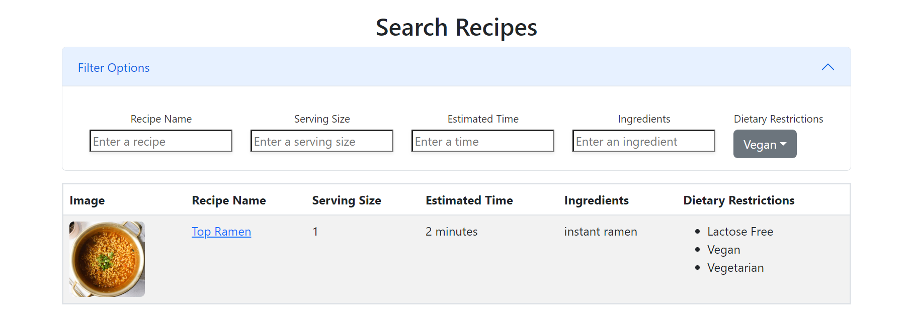

For our final project in my Software Engineering class, we were tasked to create a working application using the Meteor Framework. Even though this class was my first experience with Meteor, the work we had done thus far made me feel adequately prepared for the challenge. We were given a basic meteor template to start off, and implemented our own changes from there. Through this experience I've noticed how some common design patterns emerge while coding. These design patterns are vital when it comes to web application design and approaching problems.  

### Applying Design Patterns

Design patterns can be defined as a problem that occurs over and over again in our environment, and the core of the solution to that problem. Using this definition, it's fair to say that design patterns don't exclusively appear in code and can be applied in other situations. However, for this case we will be mostly be focusing on design patterns in software development, which are general solutions to common problems in software design. 

Looking at our final project, a design pattern that was used is the Observer pattern. This is when a subject notifies the observers whenever there is a state change. One implementation was done through the use of publishers and subscribers, where the publisher was the subject and the subscribers were the observers. We were able to "subscribe" to certain publications that retrieved data from the MongoDB collections, and updated the data when there were changes. For example, if a student wanted to see all of the recipes available in the Recipe collection, we could publish the collection on the server side of the app and then subscribe on the client side to retrieve the recipe data needed to display on the page. 

Another way the Observer pattern was implemented was through the use of reactive data and states in our app. For example, if a user was on the search recipe page and wanted to filter based on dietary restrictions, we could keep track of the filter options using a hook. Once a change in the filter options was detected, this then tells the page to rerender based on the new restrictions. In the images below you can see how the page displayed the filtered data, without needing to manually refresh. 

  
  

### Delving Into Software Engineering

Though they are an important part of software development, design patterns may be hard to spot without prior experience. In my case, I brushed off a lot of these patterns as, "that's just how they do things" or, "that's just common sense". Even if it may appear that way now, there was a time where these design patterns did not yet exist. Understanding these patterns and when/how to apply them is crucial for a successful career in software development, and is something that I will pay more mind towards in the future. 