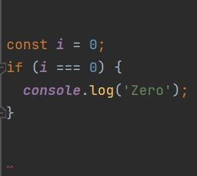

### Coding Standards?

As collaboration and open source code continues to grow, the need for readable code becomes more relevant. Coding standards are one way to improve the quality of your code and make it easier for others to understand your work. It may seem tedious and unnecessary at first (I still feel that way sometimes), but it's a good skill to learn before you go out into the world and start working on large-scale projects. 

### Putting It Into Practice 

One coding standard that I've been working with recently is ESLint. This is a code analysis tool that identifies and helps fix problems with your JavaScript code. Their website can be found [here](https://eslint.org/). 

This is my first time working with ESLint, so I had to get used to a lot of the coding standards that are enforced by it. Some examples can be seen in the images below. Note that they appear as errors instead of warnings since we are currently practicing these standards in class. 

<div class="text-center p-4">
  
  
</div>

In the first image, you can see that an error is shown with the use of the double equals, a comparison operator. Since we're comparing the value of ```i``` to ```0```, ESLint suggests that a triple equals, a strict equality comparison operator, is used instead. This means that ```false``` is returned for values that are not a similar type, like ```0``` and ```'0'```. I tend to mainly use the double equals when coding, so I get this error pretty often when using ESLint. 

In the second image, you can see there is an error for the curly brackets and for the ```console.log()```. This is because there should be a space between the parentheses and curly bracket, something that I normally don't do. The quotations inside the ```console.log()``` should also be single quotes, which is another thing I don't normally do. The corrected code without the errors can be seen below.

<div class="text-center p-4">
  
  
</div>

Errors like these may seem small and insignificant but they can be a pain to deal with if left to pile up. I often found myself going through my finished code just to fix the barrage of errors I received. However, even if it can be annoying to fix, it just encourages me to get it right the first time, leading to better code written according to the ESLint standards.

So what's my advice for consistent coding? It may be annoying at first to deal with all the errors, but it will ultimately lead to you developing standardized code and make it easier for others to understand what you've written. I also highly recommend using IDEs like IntelliJ when possible: they automatically show you the errors so you don't need to keep referring to the coding standards.
