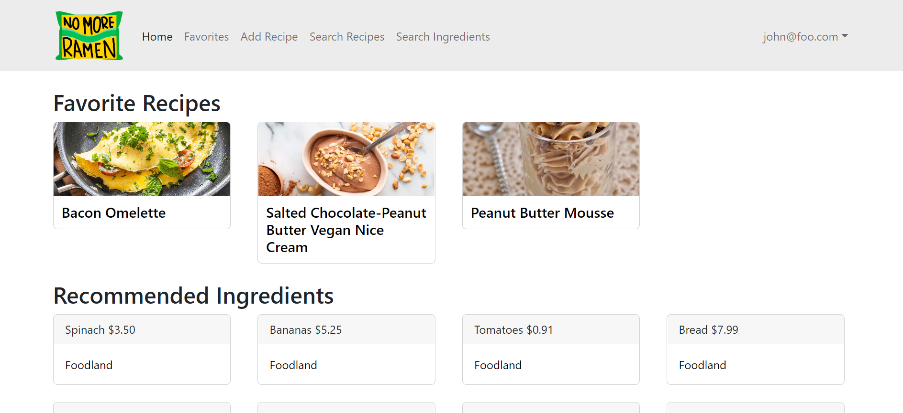
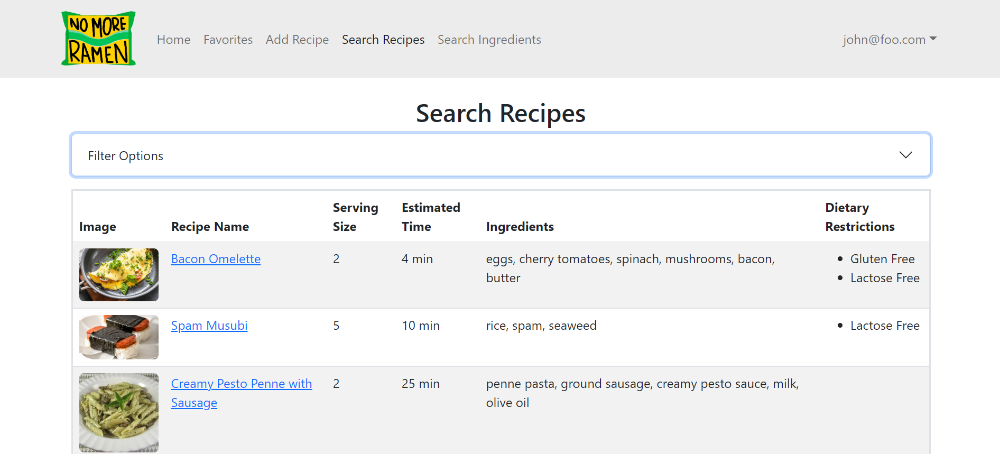
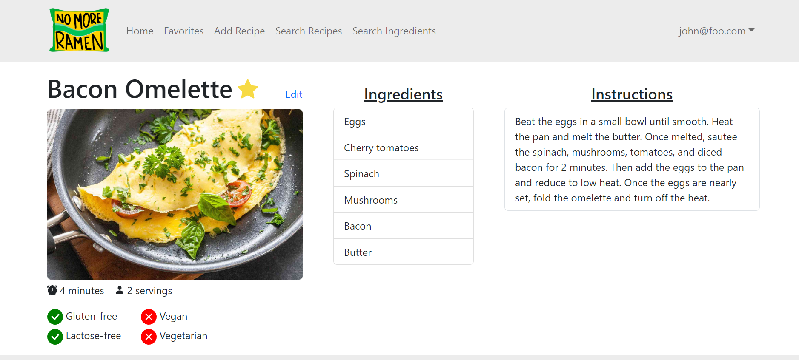

This was a group project for my ICS314 class. We wanted to create a web application that would allow college students to learn about new recipes and share their existing ones. Since many college students have limited cooking skills and limited access to groceries and appliances, we thought that it would be a good tool to encourage more cooking. The app also allowed vendors to add what ingredients they have available to sell, with information such as the price and quantity. There was also an admin role for moderating the site. 

Some images of the final product can be seen below. Students were able to add their recipes, search for existing recipes created by other students, and favorite any specific ones they may be interested in. Vendors could create a profile and add their ingredients to the site. Admins could view a list of all the users, recipes, and ingredients, and fully edit the information when needed.

      
    <strong>Home page for students.</strong>

      
    <strong>The search recipe page.</strong>

      
    <strong>One example of a full recipe page.</strong>

I worked on creating the Add Recipe page, Search Recipe page, and the Favorites page. I also worked a little with the MongoDB collections and the logic of assigning the correct role to new users when they register. This project helped me utilize the skills I learned from this class, such as Meteor, Bootstrap, and React. I was able to gain more experience working with Github issues and project boards. It also emphasized the importance of creating new branches for new issues to ensure that the main branch is always functional.

You can learn more about our project at the No More Ramen [Organization Page](https://no-more-ramen.github.io/).
