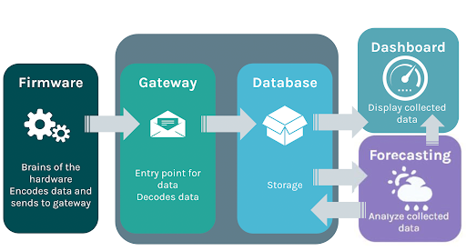

I was a member of SCEL (Smart Campus Energy Lab) at UH Manoa for 2 semesters. SCEL focuses on designing, fabricating, and deploying a network of sensor modules across the university campus to collect meteorological data and forecast short-term photovoltaic power production. We would then be able to analyze the data collected, such as temperature, solar irradiance, humidity, and pressure, to help locate the optimal places on campus for renewable energy sources. 
 
During my time with SCEL, I was a member of Team Firmware. This team works on maintaining the code for the weatherboxes and implementing improvements when needed. I worked with the other team members to create a staging environment for testing changes before they were applied to the main gateway server. We also converted the Python 2 code to Python 3 to stay updated. When the hardware teams had an issue relating to the code, we were there to help troubleshoot. 

While working on Team Firmware, I learned a lot about the weatherbox data transmission process. We learned how the sensors on the roof read data and then send to the gateway server using XBees, and how the server then stores the information in the database. You're able to see the general flow of the data in the image above. I also gained a lot of experience working in a team. This was mostly during the COVID-19 pandemic, so we had to find ways to communicate virtually and divide up the work. 
