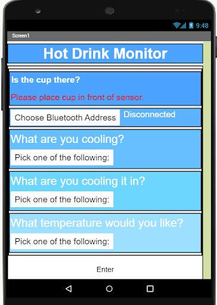

<div class="text-center p-4">
  
  
</div>

This was a project done for EE296, where I worked with a partner to create a product using an Arduino and MIT App Inventor. The purpose of the Wait n Drink is to make sure that children can safely consume their hot drinks without burning their tongues. People with sensitive tongues can also use this product. Users can select a number of different options and place cup in front of our prototype. It will let users know when the drink is ready.

For our prototype shown in the images above, we had an ultrasonic sensor that detected when a cup was placed nearby. Once detected, users can use the UI interface to select their type of drink, cup material, and desired temperature. The app would then notify you when the drink was ready by measuring the temperature of the cup using another sensor. 

My contribution to the project involved writing the arduino code for the various sensors used. I also created the breadboard for the circuit. From this project, I was able to learn more about working with Arduino and designing mobile apps. I also gained more experience working in a team, since I had to collaborate a lot with my partner.

Here is some code that illustrates how the sensor values were read::

``` 
  // ultrasonic sensor configuration
  long duration, distance;

  //initial detection 
  while (!detection){
    digitalWrite(trigPin, LOW);
    delayMicroseconds(2);
    digitalWrite(trigPin, HIGH);
    delayMicroseconds(10);
    digitalWrite(trigPin, LOW);
    duration = pulseIn(echoPin, HIGH);
    distance = (duration/2) / 29.1;
    
    //If cup is on tray, set detection to true
    if(distance < 5){
      detection = true;
      Serial.print("ready");
    }
    delay (1000);
  }
  
  //read in temp value sent from app
  while(!processing){
    while (Serial.available() == 0) {
    }
    appData = Serial.read();
    
    //Convert value recieved from app into actual temp
    temp = convertValue(appData, toohot, almost);
    
    processing = true;
    initial = true;
    starttime = millis();
  }
```

You can see the full code at the [Wait n Drink Repo](https://github.com/kayla-hirano/EE296-Project-WaitN-Drink-Fall-2020).
